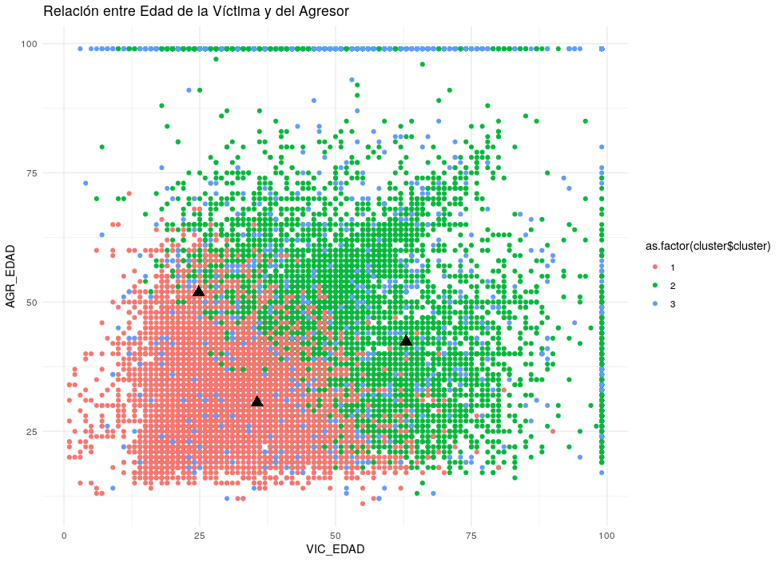

# 🧠 Tarea 4 – Análisis de Clústeres (K-Means)

## 🔹 Aplicación del Algoritmo K-Means

Se aplicó el algoritmo **K-Means** sobre el conjunto de datos de violencia intrafamiliar en Guatemala (año 2024), utilizando las variables:

- `VIC_EDAD` → Edad de la víctima  
- `AGR_EDAD` → Edad del agresor  

El objetivo fue **identificar patrones o grupos** de casos similares según las edades involucradas.

---

## 🔹 Visualización del resultado

El siguiente gráfico muestra la relación entre la edad de la víctima (eje X) y la edad del agresor (eje Y). Cada punto representa un caso, y los colores indican los tres clústeres generados por el modelo.

📈 **Gráfico:** Relación entre Edad de la Víctima y del Agresor  

---

## 🔹 Interpretación general

- Existe una **relación directa entre la edad de la víctima y la del agresor**: a mayor edad de la víctima, mayor edad del agresor.  
- Esto sugiere que los incidentes ocurren principalmente **entre personas de rangos etarios similares**, como parejas o convivientes.  
- Los triángulos negros (▲) representan los **centros de cada clúster**, es decir, el promedio de edad de cada grupo identificado.

---

## ⭐ Clúster más relevante: **Clúster 2 (Verde)**

El **clúster verde** concentra la mayoría de los casos analizados.  
Corresponde a **adultos entre 30 y 55 años**, tanto víctimas como agresores.

---

## 📋 Conclusión

El análisis con **K-Means** permitió descubrir que la **violencia intrafamiliar se concentra principalmente entre adultos de 30 a 55 años**, y que la edad del agresor suele estar estrechamente relacionada con la de la víctima.  
